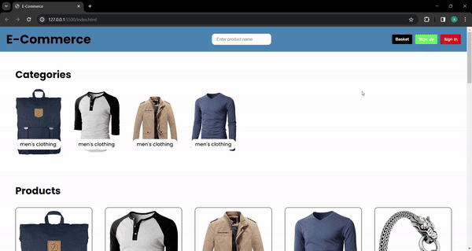

<h1>E-Commerce Project</h1>

This is an e-commerce website. Users can look at the products, add the products to the cart, see the total price and remove them from the cart. Within the website, product information is retrieved dynamically using an existing product API.

<h2>Project Content</h2>

<ul>
  <li>Categories</li>
  <li>Products Page</li>
  <li>Modal Basket</li>
</ul>

<h2>Used Technologies</h2>

<ul>
  <li>HTML</li>
  <li>CSS</li>
  <li>JavaScript</li>
</ul>

<h1>Screen Gif</h1>

